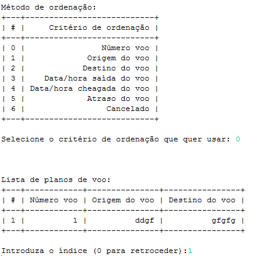

Airport-Management-System
==================

## Overview

Implementation of an airport management system capable of:
- Manage airline companies
- Manage passenger check-ins
- Manage flights

Figure 1: Main menu

Figure 2: Airlines menu

Figure 3: Check-in menu

Figure 4: Passengers menu

Figure 5: Flights menu

Figure 6: Airline management menu

Figure 7: Flight management menu

Figure 8: Flight list menu

Figure 9: Flight managenent menu

Figure 10: Closed flights list menu
